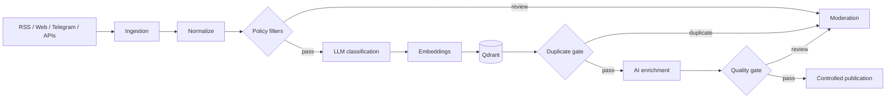

# RAG Content Pipeline Architecture

Production-derived architecture case study for a content intelligence pipeline built around Laravel, LLM processing, embeddings, Qdrant, moderation and controlled publishing.

## Problem

Calling an LLM is easy. Running a continuous content pipeline without publishing duplicates, advertisements, low-quality rewrites or stale semantic records requires explicit control boundaries.

This design separates probabilistic AI work from deterministic application control.

## Pipeline



## Architectural rules

- AI output is input to policy, not authority.
- External side effects stay behind deterministic gates.
- Relational state remains authoritative; vector storage is semantic operational memory.
- RAG synchronization reconciles expected vectors and removes stale points.
- Duplicate detection runs again at the publication boundary.
- A scoped lock protects parallel publication races.
- Expensive work runs through retryable queue jobs.
- Moderation is a normal workflow state.
- External AI and vector failures are explicit rather than silently converted to success.

## Production-derived patterns

### Semantic and structural deduplication

Vector similarity is combined with structured event signals and scoped time windows. Similarity alone is not treated as sufficient evidence of duplication.

### Publication race protection

Two workers may process different articles about the same event concurrently. The final duplicate check runs under a lock. An accepted article becomes visible to semantic search before that lock is released.

### Vector reconciliation

When an article becomes ineligible or its publication scope changes, synchronization removes vector points that are no longer expected instead of treating the vector database as append-only.

### Deterministic boundaries

Minimum source quality, obvious promotional patterns, state eligibility and routing remain deterministic. LLMs are used where semantic interpretation provides value.

## Repository

```text
docs/
  architecture.md
  failure-model.md
examples/
  SyncArticleRagJob.php
  PublicationBoundary.php
  QdrantRepository.php
```

The examples are sanitized and intentionally compact. The production repository remains private. This case contains no production credentials, customer data, database dumps or private infrastructure configuration.

## Stack

Laravel / PHP / queues / LLM APIs / embeddings / Qdrant / relational database / multi-channel publishing

## What this demonstrates

This is not a chatbot demo. It demonstrates how LLMs and vector search can operate inside a controlled asynchronous application with deterministic policy, concurrency protection, semantic deduplication, moderation and recoverable external side effects.

---

**Production AI systems with deterministic boundaries and reliable recovery.**

ifreework.com · Telegram: @ifwcom
