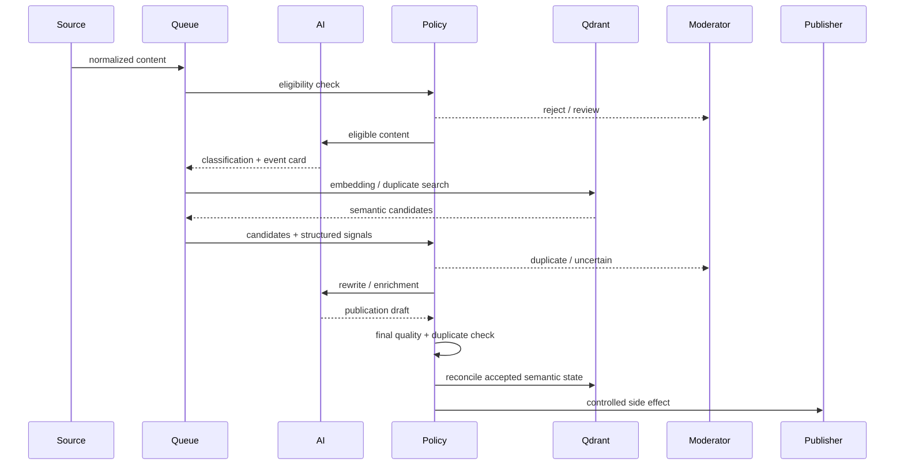

# Architecture

## Trust boundaries

The pipeline separates four concerns:

1. **Source layer** — untrusted external content.
2. **AI layer** — probabilistic extraction, classification, rewriting and embeddings.
3. **Control layer** — deterministic eligibility, duplicate policy, locks and workflow transitions.
4. **Side-effect layer** — vector writes and external publication.

An LLM response never directly authorizes a publication side effect.

## Data flow

## Qdrant is not the source of truth

Vector storage answers semantic questions efficiently. Workflow truth remains in the relational application model. A vector-database outage can stop semantic processing without corrupting authoritative article, moderation or publication state.

## Concurrency

Queue uniqueness prevents redundant work for one article, but it does not solve the important race: two different articles about the same event can be processed simultaneously.

The publication boundary therefore performs a final semantic duplicate check under a scoped lock. The accepted record is made visible in semantic memory before releasing that lock.

## Reconciliation

Vector synchronization converges toward the expected state:

- stable point identities allow safe upsert
- eligible scopes define the expected point set
- obsolete points are deleted
- an ineligible article is removed from semantic memory

This prevents stale vectors from affecting later duplicate decisions.
